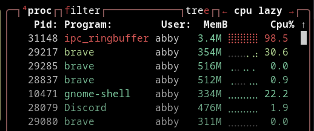
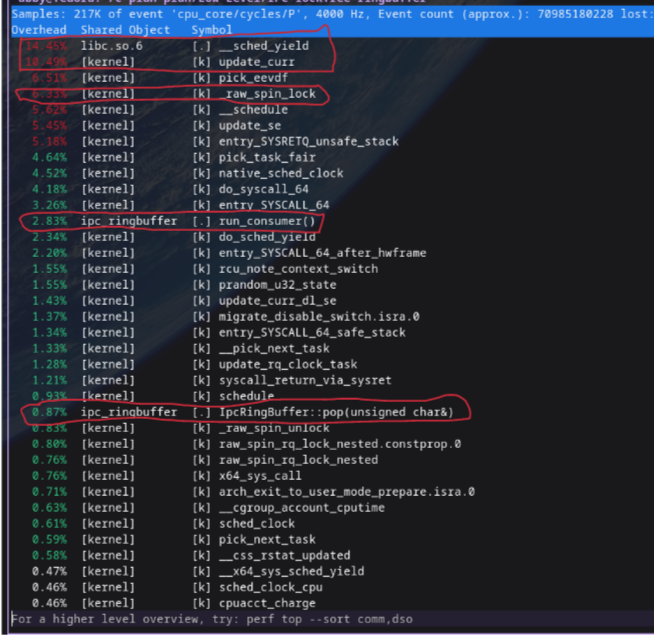
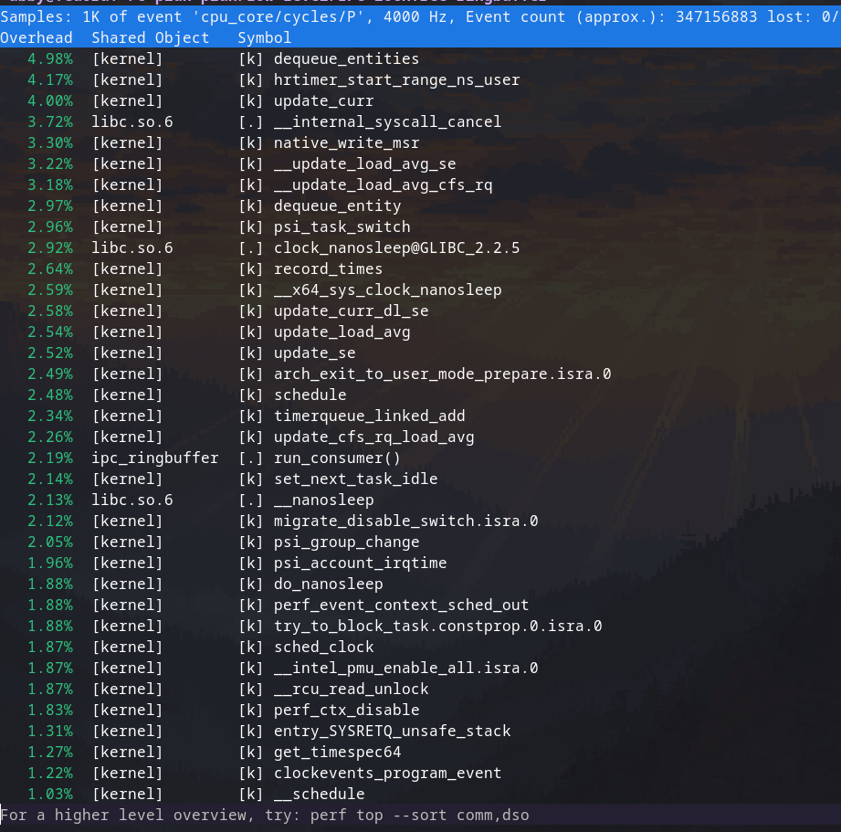

# Performance Bottleneck: CPU Thrashing and Yield Storm

## The Problem

In the naive lock-free implementation of the consumer's `run_consumer` method:

```cpp
void run_consumer() {
  IpcRingBuffer ring_buffer;
  if (!ring_buffer.init_as_consumer(SHM_NAME)) {
    std::cerr << "Failed to init consumer\n";
    return;
  }

  std::cout << "[Consumer] attatched. Listening for data...\n";
  uint8_t value;
  while (true) {
    if (ring_buffer.pop(value)) {
      std::cout << "Received: " << (int)value << "\n";
    } else {
      std::this_thread::yield();
    }
  }
}
```

when the ring buffer is empty, the consumer thread continuously polls the buffer.
To prevent the thread from locking up the CPU, the initial approach used std::this_thread::yield() to hand execution time back to the OS.
However, when running the consumer in an isolated or mostly idle system, this caused the process to pin a CPU core at 100% utilization.

## Profiling Evidence

When running the `./ipc_ringbuffer consumer` first, I noticed that the process was almost using 100% of the cpu but that was the exact opposite what yield() was used for.



Then, I obtained the pid of the process by `pidof ipc_ringbuffer` and  profiled the consumer with Linux `perf`:

```bash
sudo perf top -p <PID>
```

which revealed that the CPU was not thrashing on atomic memory reads, but was instead caught in a Yield Storm.



**The Root Cause** : When yield() is called, it triggers a context switch from user space into the OS kernel. The kernel looks for other threads waiting for CPU time.
Because the system is idle, it finds none and immediately hands execution back to the consumer thread.
The consumer instantly checks the empty buffer, calls yield() again, and triggers another context switch.
The CPU is maxed out simply rapidly switching into and out of the kernel space hundreds of thousands of times per second.

## The New Approach : Exponential Backoff

To fix the yield storm without sacrificing the ultra-low latency of a lock-free architecture, we replace the blind yield() with a 3-phase Exponential Backoff Strategy:

- **Phase 1** (*Tight Spin*): Check the buffer a few times in a tight loop. This provides zero-latency reads if a message arrives immediately.

- **Phase 2** (*Yield*): If still empty, yield to the OS briefly to let other threads on the same core run.

- **Phase 3** (*Sleep*): If the buffer remains empty after several yields, execute a hard micro-sleep (std::this_thread::sleep_for). This removes the thread from the OS scheduler entirely for a set duration, breaking the yield storm and dropping CPU usage to near 0%.

```cpp
class SpinBackoff {
    int attempts = 0;

public:
    void spin() {
        attempts++;
        
        if (attempts < 10) {
            // phase 1: tight spin for ultra-low latency
            // optional: cpu pause instruction here on x86
        } 
        else if (attempts < 20) {
            // phase 2: yield (hand time-slice to other ready threads)
            std::this_thread::yield();
        } 
        else {
            // phase 3: hard sleep to prevent yield storms and CPU thrashing
            std::this_thread::sleep_for(std::chrono::microseconds(1));
        }
    }

    void reset() {
        attempts = 0;
    }
};
```

## Performance after the approach

After implementing spin backoff strategy, I profiled the `./ipc_ringbuffer consumer` alone again with Liunx `perf` and got the following results:


