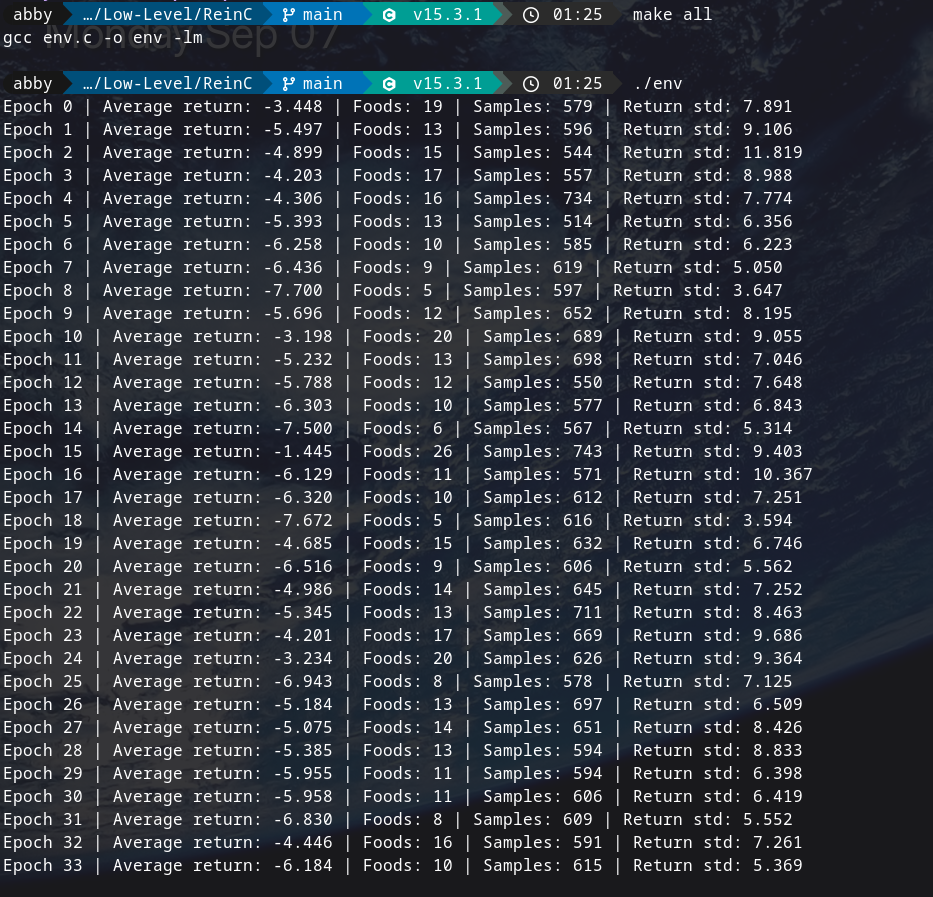

# ReinC
A Reinforcement Learning Model made in C

## How to build and run
1. Install [raylib](https://www.raylib.com/)
2. run `make`
3. run
  - `./snake_train`   opens a window, renders episode 0 of every epoch
  - `./snake_train 5` only renders episode 0 every 5th epoch (trains faster overall)
  - `./snake_train 0` no window at all, original full speed headless training

### Controls in the window
- **Hold space** - fast forward the episode you're watching
- **esc / close window** - stop watching, training keeps going headless in the terminal for the rest of the run

## Some Revision of the concepts

### Forward Pass
In this [drawio](./assets/forward_pass_flowchart.drawio) of forward pass, it is shown how an input vector x gets transformed step-by-step into output class probabilities.

**Layer 1 (hidden layer 1):**

1. Input x : the input vector goes in.
2. Matmul (W0 × x) : multiply the input by weight matrix W0.
3. Add (b0) : add the bias vector b0 to that result.
4. Activation / Z1 : pass the result through a non-linear activation function (like ReLU or sigmoid) to get Z1, the output of the first hidden layer.

**Layer 2 (hidden layer 2):**

5. Matmul (W1 × Z1) : multiply Z1 by the second weight matrix W1.
6. Add (b1) : add bias b1.
7. Activation / Z2 : apply activation again to get Z2, the second hidden layer's output.

**Output layer:**

8. Matmul (W2 × Z2) : multiply Z2 by the final weight matrix W2.
9. Add (b2) : add the final bias b2. This produces the raw output scores, often called logits.
10. Softmax : convert those logits into a probability distribution (values between 0 and 1 that sum to 1).
11. Output probabilities : the final result: a probability for each class.

---

### Backward Pass
In this [drawio](./assets/backward_pass_flowchart.drawio) of backward pass, it is shown that this mirrors the forward pass structure but runs in reverse

1. Output probs & labels y : you need both the prediction and the ground truth to start.
2. Loss (Cross-Entropy) : measures how wrong the prediction was.
3. dLogits = probs − y : the elegant shortcut: softmax + cross-entropy combine so the gradient at the output layer is just this simple subtraction.
4. Backprop Add (b2) : branches off db2 (gradient w.r.t. bias just equals the incoming gradient, unchanged).
5. Backprop Matmul (W2) : branches off dW2 (gradient w.r.t. weights = gradient × previous activation, transposed), and passes the gradient further back.
6. Activation' (Z2) : multiply by the derivative of the activation function (chain rule). Same pattern repeats for b1 / W1 / Z1 and same pattern repeats for b0 / W0 (the first layer).
7. Update parameters : once you have all the dW's and db's, apply gradient descent (W -= lr * dW).

## Training of the Snake env

